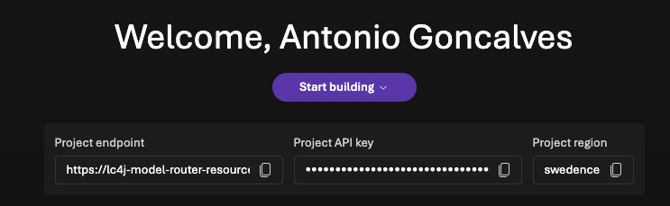
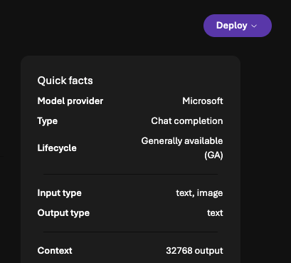
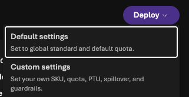
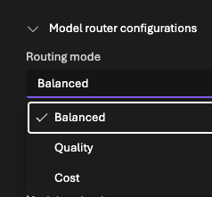
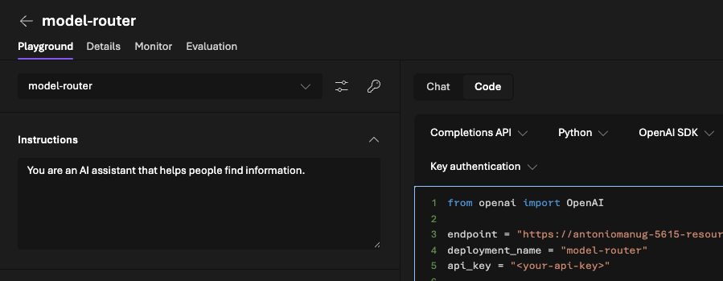
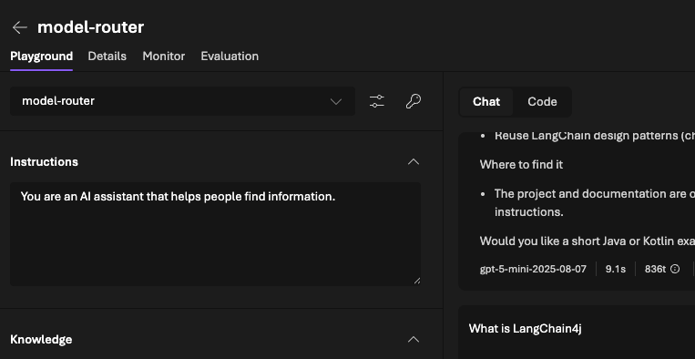

# Smart Model Selection with Microsoft Foundry Model Router and LangChain4j

When building AI-powered applications, we often default to the most powerful model available: GPT-5.2 for everything! It's the safe choice.

But it's also expensive and often overkill. The challenge is that manually routing prompts to appropriate models requires building and maintaining complex decision logic. We need to evaluate prompt complexity, match it to model capabilities, and update routing rules as new models emerge.

What if the infrastructure could make this decision for us?

## Enter the Model Router

Microsoft Foundry offers a Model Router that automatically selects the most appropriate model for each request. Instead of hardcoding a specific model, we point our application at the router endpoint, and it intelligently dispatches prompts to the right model based on complexity, cost, and capability requirements.

The Model Router is itself a model: we deploy and call it like any other model in Microsoft Foundry. But instead of processing prompts directly, it analyzes them and routes to the optimal model from its supported pool.

The router currently supports a subset of the 11,000+ models available in Microsoft Foundry:

- GPT-5 family (including gpt-5-nano, gpt-5-chat)
- GPT-4.1
- o4-mini
- DeepSeek
- Llama 4
- Claude 4.5 family (Sonnet, Opus)

The Model Router can be customized with three routing modes:

- **Balanced** (default): Optimizes for a mix of quality, speed, and cost
- **Quality**: Prioritizes response quality, selecting more capable models
- **Cost**: Focuses on cost efficiency, preferring lighter models when appropriate

## Deploying a Model Router in Microsoft Foundry

Let's walk through deploying the Model Router and retrieving the credentials needed for our Java application.

**Step 0: Log in to Microsoft Foundry**

Go to https://ai.azure.com/nextgen/ and make sure you have access to Microsoft Foundry.



**Step 1: Access the Model Catalog**

Navigate to the Microsoft Foundry portal and browse the Model Catalog. Search for "Model Router" in the search bar.


**Step 2: Select the Model Router**

Click on the Model Router card. You'll see details about the supported models and routing capabilities.



**Step 3: Deploy the Model**

Click the Deploy button. Choose your deployment options:

* Default Settings: Give your deployment a meaningful name (e.g., model-router-prod)
* Custom Setting: That's where you can configure the routing modes (Balanced, Quality, or Cost)




**Step 4: Retrieve the Endpoint and API Key**
Once deployed, navigate to your deployment's overview page. Here you'll find:

* Endpoint URL: The base URL for API calls (e.g., https://<your-resource>-resource.openai.azure.com/openai/v1)
* API Key: Click Show Keys to reveal your authentication key



Copy both values—we'll use them in our Java code.

**Step 5: Test the Deployment**

Use the built-in playground to verify your deployment is working before writing code. Send a simple prompt and confirm you receive a response.



## Our Test Case

To see this in action, we'll send two very different prompts through the Model Router:

* **Simple prompt** (~120 tokens): "What is LangChain4j?"
* **Complex prompt** (~1,700 tokens):
A detailed request to generate a comprehensive LangChain4j newsletter, including sections on new features, migration guides, code examples, community highlights, and upcoming events with specific formatting requirements and structural constraints.

## Let's Code

Microsoft Foundry's Model Router exposes an OpenAI-compatible API. So, integrating it with LangChain4j is straightforward: we use the existing OpenAI module and point it at the Foundry endpoint.

First, add the LangChain4j OpenAI dependency:

```xml
<dependency>
    <groupId>dev.langchain4j</groupId>
    <artifactId>langchain4j-open-ai</artifactId>
</dependency>
```

Now configure the chat model to use the Model Router:

```java
public class ModelRouterDemo {

  private static final String MICROSOFT_FOUNDRY_API_KEY = System.getenv("MICROSOFT_FOUNDRY_API_KEY");
  private static final String MICROSOFT_FOUNDRY_ENDPOINT = "https://<your-resource>-resource.openai.azure.com/openai/v1/";

  public static void main(String[] args) {

    ChatModel model = OpenAiChatModel.builder()
      .apiKey(MICROSOFT_FOUNDRY_API_KEY)
      .baseUrl(MICROSOFT_FOUNDRY_ENDPOINT)
      .modelName("model-router")
      .build();

    // Simple prompt
    ChatResponse simple = model.chat(new UserMessage("What is LangChain4j?"));
    System.out.println("Model " + simple.metadata().modelName() + " responded:");
    System.out.println(simple.aiMessage().text());

    // Complex prompt
    ChatResponse complex = model.chat(new UserMessage("Ultrathink and update this LangChain4j newsletter ....:"));
    System.out.println("Model " + complex.metadata().modelName() + " responded:");
    System.out.println(complex.aiMessage().text());
  }
}
```

The key point: we use `OpenAiChatModel` but point it at the Microsoft Foundry endpoint. The `modelName("model-router")` tells the service to use the model router rather than a fixed model. The `metadata().modelName()` of the response reveals which model was ultimately selected.

## The Results

Running both prompts with logging enabled reveals the routing decisions:

**Simple prompt**:
```
Model selected: gpt-5-nano-2025-08-07
Tokens: 121 input, 539 output
```

The router chose `gpt-5-nano`, a lightweight, fast model perfect for straightforward factual queries.

**Complex prompt (newsletter generation)**:
```
Model selected: gpt-oss-120b
Tokens: 1,662 input, 3,912 output
```

For the complex generation task, the router escalated to `gpt-oss-120b`, a 120-billion parameter model capable of handling sophisticated reasoning and long-form generation.

The cost difference between running both prompts through gpt-oss-120b versus letting the router optimize is significant.

## Conclusion

Choosing the right model for each task shouldn't require maintaining complex routing logic. The Model Router brings intelligence to model selection, matching prompts to appropriate capabilities automatically.

The integration with LangChain4j is seamless thanks to OpenAI API compatibility. A few lines of configuration, and our Java application gains smart model routing without architectural changes.

If you want to dive deeper into building production-ready AI applications with Java, including advanced patterns for RAG, function calling, memory management, and enterprise integrations, check out my book on LangChain4j.


## References

* [The code for this example is available on GitHub](https://github.com/agoncal/agoncal-sample-langchain4j/tree/main/foundry-model-router)
* [My LangChain4j book](https://agoncal.teachable.com/p/ebook-understanding-langchain4j)
* [Microsoft Foundry](https://ai.azure.com/nextgen)
* [Model router for Microsoft Foundry](https://learn.microsoft.com/en-us/azure/ai-foundry/openai/concepts/model-router?view=foundry&preserve-view=true)
* [Use model router for Microsoft Foundry](https://learn.microsoft.com/en-us/azure/ai-foundry/openai/how-to/model-router?view=foundry&preserve-view=true)
* [What's new in model router in Microsoft Foundry Models?](https://learn.microsoft.com/en-us/azure/ai-foundry/foundry-models/whats-new-model-router?view=foundry)
